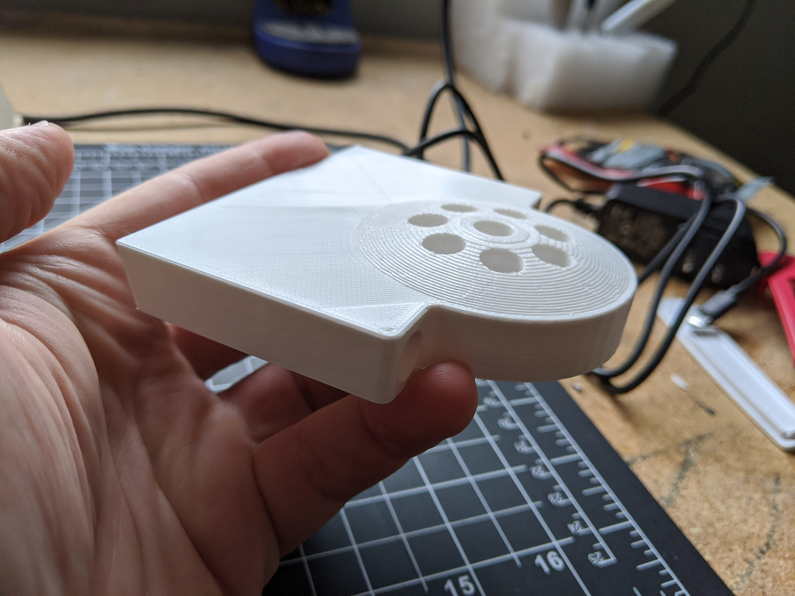

# 8 Spout Dispenser from Donald Bell

Notes on spout design.

This 8-tube design was modified by Donald Bell from a design shared on Thingiverse by dwmartin805 that accommodates 15 tubes. https://www.thingiverse.com/thing:500062

Like the original the holes are designed to fit 3/16" ID polyethylene barbed tube fittings (McMaster 2808K105) that loosely seat into each hole and can be glued in place for a more permanent design. Being able to remove them makes them a little easier to clean, though.

Because of the initial design of my cocktail robot, I built in a slight angle to where it attaches. I imagine most people will want to throw this into their CAD software and have it attach at a right angle. 

I printed mine in PLA with 10% infill and it's worked fine for my prototype so far, especially since it doesn't take any weight and really just organizes the tubes.
