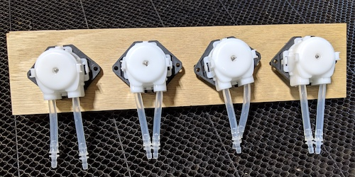
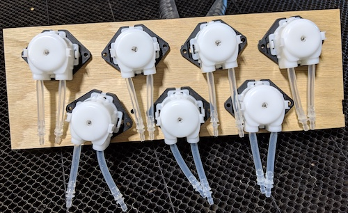
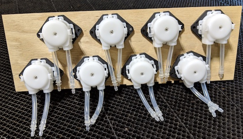

# Motor Plates/Panels

What if you have a bot and you just want to mount some motors? Here are a
selection of plates which you can laser but and mount however works best
for you.

The DXF and SVG files contain what should be the same informtion.

Laser cut from 6 mm (1/4") material. Customize to fit your needs by adding
mounting holes or whatever you need.

# Four pumps in a narror plate

# Seven pumps in an offset pattern. 

# eight pumps in an offset pattern. 

# Eight pumps in a symmetrical pattern. The hoses are routed in an awkward way, 
but this may layout may have utility.

